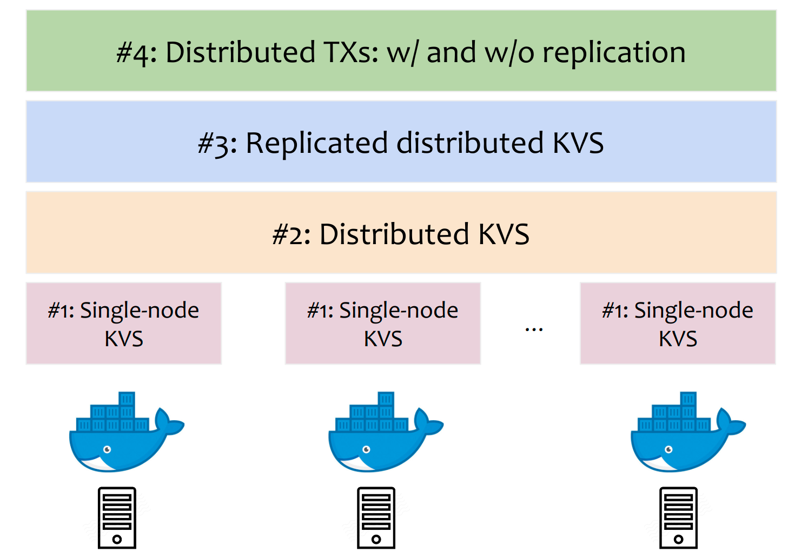

# Lab: Cloud Systems Engineering  (“cloud-lab”) -- WiSe 2022

## Chair website

- The lab is organized by the [Chair of Decentralized Systems
  Engineering](https://dse.in.tum.de/) at TU Munich.

## Course information

- Language: English
- Type: Practical Course (Lab)
- Module: IN0012, IN2106, IN2128
- SWS: 6
- ECTS Credits: 10
- Prerequisites: basic concepts of operating systems, distributed systems, 
  and systems programming (C, C++, Rust)
- TUM Online: We will enroll you before the lab starts. Do not forget to
  register in the matching system to obtain a seat in the lab!
- Course Material: For each programming assignment task, we will cover the
  necessary background at the beginning of each module as a short lecture,
  where we will present the necessary details with comprehensive references.
- Time and Location: 3-5 lectures on youtube, each before the next stage in the
  project.

## Content

Cloud engineering involves building scalable and fault-tolerant cloud systems
in a  cost-effective manner. In this lab, we will investigate how to build
cloud systems from the ground up, starting from a single-node deployment up to
a fully replicated and distributed transactional system.  As part of the lab,
we will cover a range of topics through a set of lectures with the necessary
background and associated programming assignments over the semester. Note that
the programming assignments will build the complete system stack in an
incremental fashion, where each assignment will build on the previous stage.

## Registration info

- **Capacity:** We plan to have at most 60 places in this course.
- **Registration deadline:** Two weeks after the matching period, we will
  formally register you in the course. If you want to drop out, please inform
  us before the registration deadline.  

## Slack workspace

We will use Slack for all communication. Please enroll in our Slack workspace
using your official TUM email address.

- **Slack workspace:** https://ls1-courses-tum.slack.com
- **Slack channel:** #ws-22-cloud-lab

## Meeting place

We will be meeting at the following location for Q&A sessions:

- Join Zoom Meeting: [Link](https://tum-conf.zoom.us/j/69569093330)
  Meeting ID: 695 6909 3330 Passcode: 824318

## Schedule and material

- **Lecture videos playlist** :
  - [SoSe 2022 YouTube playlist](https://www.youtube.com/watch?v=JPUf37_hB5g&list=PLfKm1-FQibbAKAx6fji1YE6eKsd79RrP-)

| Topic and slides                                                     | Q&A sessions                             | Task duration |
|----------------------------------------------------------------------|------------------------------------------|---------------|
| [Kick-off meeting](docs/WS-22/kick-off.pdf)                          | 18.07                                    | N/A           |
| [Task #1: Single-node KVS](docs/WS-22/task-1-rocksDB.pdf)            | 20.10, 27.10, 03.11                      | 3 weeks       |
| [Task #2: Distributed KVS](docs/WS-22/task-2-sharding.pdf)           | TBA                                      | 3 weeks       |
| [Task #3: Replication](docs/WS-22/task-3-replication.pdf)            | TBA                                      | 3 weeks       |
| [Task #4: Transactions](docs/WS-22/task-4-transactions.pdf)          | TBA                                      | 3 weeks       |

## Grades

Grades are computed as follow:

| From | To  | Grade |
|------|-----|-------|
| 0    |  16 | 5.0   |
| 17   |  34 | 4.7   |
| 35   |  49 | 4.3   |
| 50   |  55 | 4.0   |
| 56   |  60 | 3.7   |
| 61   |  65 | 3.3   |
| 66   |  70 | 3.0   |
| 71   |  75 | 2.7   |
| 76   |  80 | 2.3   |
| 81   |  85 | 2.0   |
| 86   |  90 | 1.7   |
| 91   |  95 | 1.3   |
| 96   | 100 | 1.0   |

## Contact

We *strongly* prefer slack for all communications. For any further
questions/comments, please contact the course organizer(s):
  - [Prof. Bhatotia](https://dse.in.tum.de/bhatotia/)
  - [Dimitrios Stavrakakis](https://dimstav23.github.io/)
  - [Emmanouil (Manos) Giortamis](https://dse.in.tum.de/manos-giortamis/)
